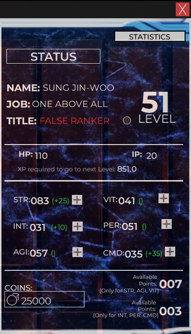

# The System (Solo Levelling)
This is just a fun project I made, trying to emulate and fulfil the function that The 'System' in Solo Levelling had. (THIS IS JUST A TESTING VERSION!)

Context:

In the Anime/Manga/Light Novel, Solo Levelling, The MC has a screen only he can see that allows him to 'Level Up' his Physical Attributes such as, Strength, Agility, Vitality, Perception and Intellect. 

This Program is made to simulate that system by helping the user get motivation to work-out and gamify their life.

The GUI for this program is made using [Figma](https://www.figma.com/) and [Tkinter-Designer](https://github.com/ParthJadhav/Tkinter-Designer/tree/master) 


## Installation

This is only for a Windows machine. Linux Port is WIP

Install [Python](https://www.python.org/downloads/)

Use the package manager [pip](https://pip.pypa.io/en/stable/) to install these modules. Usually PIP is insatlled with Python

Please run the installer.bat file to install all the necesarry modules in the right versions. Or you can download the modules yourself using the CMD lines below

Tkinter

```bash
pip install tk
```
PathLib

```bash
pip install pathlib
```

Psutil

```bash
pip install psutil
```

Pillow

```bash
pip install Pillow
```

Open CV2

```bash
pip install opencv-python
```

Pandas

```bash
pip install pandas
```

Urllib

```bash
pip install urllib3
```


Also Install all the fonts in the (fonts folder)[Fonts/Montserrat-VariableFont_wght.ttf] to get the best experience.

## Usage

Run the The System Shortcut file (or The System.lnk) file in the main folder to start the program. 
If it doesn't work, please use the main.bat file


## Contributing

To Pull requests, please open an issue first
to discuss what you would like to change.

Please make sure that any new line of code works with all of the appropriate functions

I would also love any suggestions to the program

## License

[CC](https://github.com/santisoler/cc-licenses)
